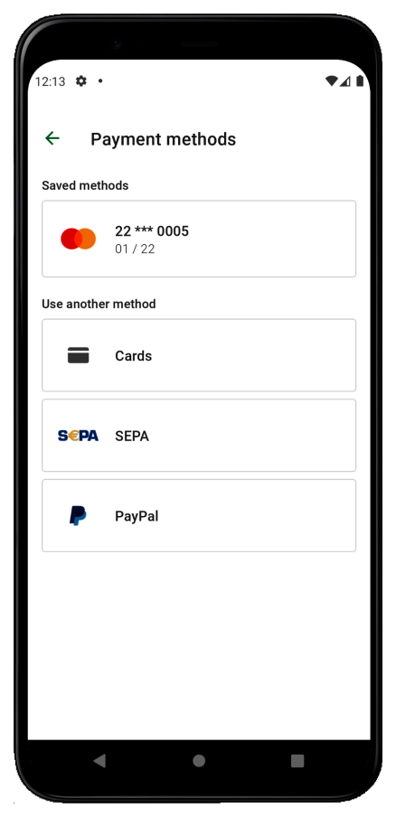
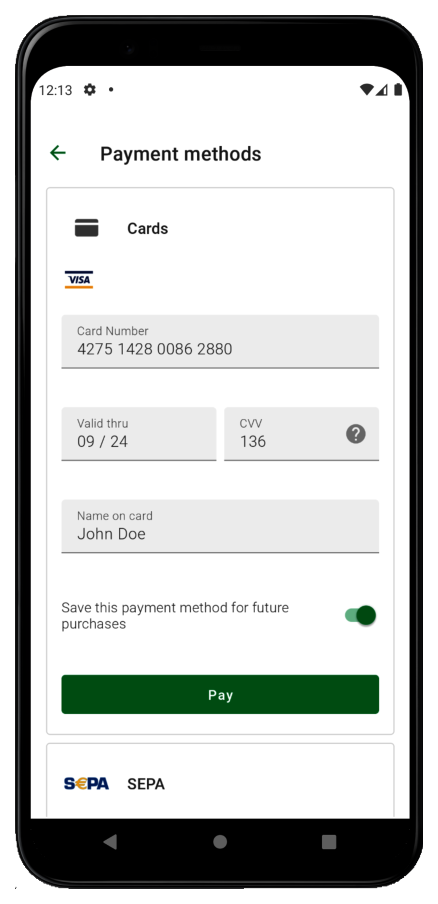
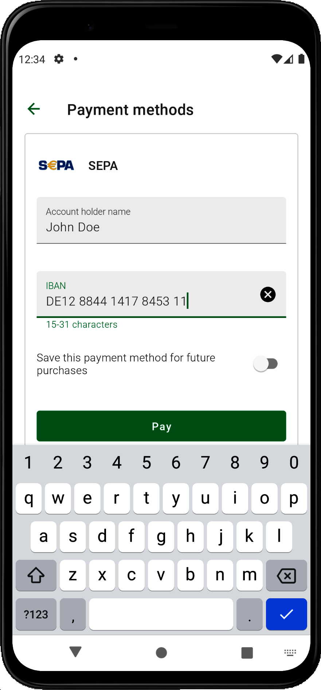

With Payoneer’s Checkout SDK for Android based devices you can accept payments in your native shop application and provide a professional checkout experience. You can render a payment page which renders the payment method scene and user interactions, and takes over all communication with the Open Payment Gateway (OPG), all at a minimum effort for you and your team, and without requiring a high level of PCI-DSS compliance.

For information about integrating the Checkout SDK into your native application, visit [optile.io](https://www.optile.io/sdks)

   